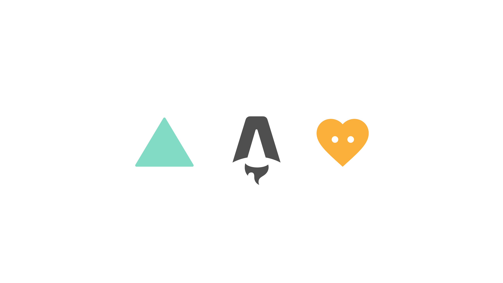

# Tres Astro 🪐

> Repository showing How to add 3D to your Astro site using [TresJS](https://tresjs.org/) a Vue custom renderer for ThreeJS


## How to use

```bash
npm install

npm run dev
```

This is the sample code of the video tutorial [How to add 3D to your Astro site](https://youtu.be/2Z3Q3Z2ZQ0w) on my youtube channel [@AlvaroDevLabs](https://www.youtube.com/@AlvaroDevLabs).